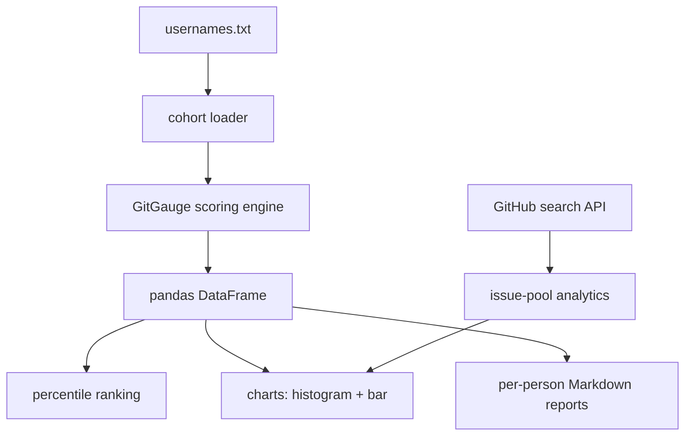

# 📊 GitGauge Analytics

**Cohort Scoring & Visual Reports for GitGauge**

GitGauge Analytics builds on the core GitGauge CLI — instead of auditing one profile at a time, it scores a whole list of GitHub users, builds a comparison table with pandas, and generates charts and per-person reports.

> **"Compare. Visualize. Improve, together."**

---

## 📑 Table of Contents

- [Overview](#overview)
- [Key Features](#-key-features)
- [How It Works](#-how-it-works)
- [Architecture](#-architecture)
- [Tech Stack](#️-tech-stack)
- [Getting Started](#-getting-started)
- [Usage](#-usage)
- [What's Next](#-whats-next)

---

## Overview

GitGauge Analytics answers a group-level question: **how does my profile compare to everyone else in my cohort, and where are the collective gaps?**

It reuses the scoring logic from the core GitGauge CLI, but instead of a single audit it processes a list of usernames into a pandas DataFrame, ranks everyone by percentile, and visualizes the results.

---

## 🔥 Key Features

| Feature | Description |
|---|---|
| 📋 Cohort Loader | Scores a list of usernames and builds a DataFrame, one row per person |
| 📈 Percentile Ranking | Ranks each person on total score and each individual criterion |
| 🧵 Issue-Pool Analytics | Summarizes a search result set — language mix, median age, low-comment % |
| 📊 Score Distribution Chart | Histogram of cohort scores with the viewer's own score marked |
| 📊 Language Bar Chart | Bar chart of open-issue counts by language |
| 📝 Per-Person Reports | Auto-generated Markdown report for every user in the cohort |

---

## 🧠 How It Works

1. **Load** — runs the GitGauge scoring pipeline across a list of usernames, skipping any that fail to fetch
2. **Structure** — builds a DataFrame with one column per scoring criterion, plus totals
3. **Rank** — computes percentile columns for total score and each criterion
4. **Summarize** — aggregates issue-search results by language, age, and comment count
5. **Visualize** — renders a labeled histogram and bar chart
6. **Export** — writes a clean, templated Markdown report per person

---

## 🏗 Architecture



---

## ⚙️ Tech Stack

- Python 3
- pandas — DataFrame, percentile ranking, groupby
- NumPy — vectorized calculations
- Matplotlib — charts
- Built directly on the GitGauge scoring engine

---

## 🚀 Getting Started

### Prerequisites

- Python 3.7+
- The core GitGauge CLI (scoring functions are reused, not reimplemented)

### Installation

```bash
git clone https://github.com//gitgauge-analytics.git
cd gitgauge-analytics
pip install pandas numpy matplotlib
```

### Configuration

Uses the same `GITHUB_TOKEN` environment variable as the core GitGauge CLI.

---

## 💻 Usage

```bash
python3 cohort.py --usernames usernames.txt
```

`usernames.txt` is one GitHub username per line.
Loaded 22 profiles (3 failed, skipped)
Charts saved to output/charts/
Reports saved to output/reports/

---

## 🗺 What's Next

Stage 3 adds hash maps and a hand-written binary search for skill-gap matching and issue recommendations.

---

<div align="center">

**GitGauge Analytics** — *Compare. Visualize. Improve, together.*

</div>
